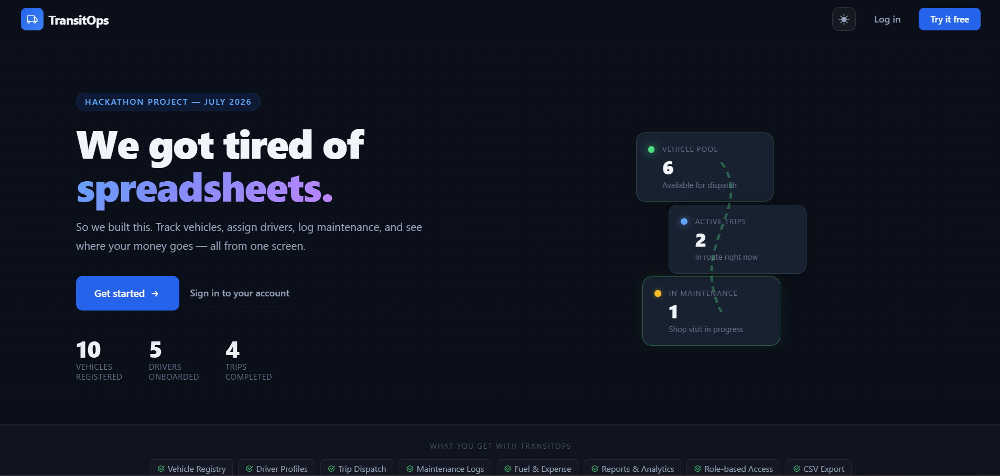
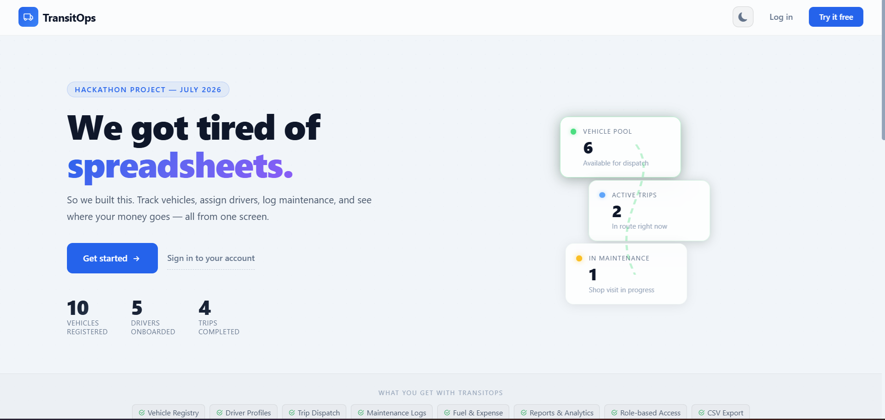
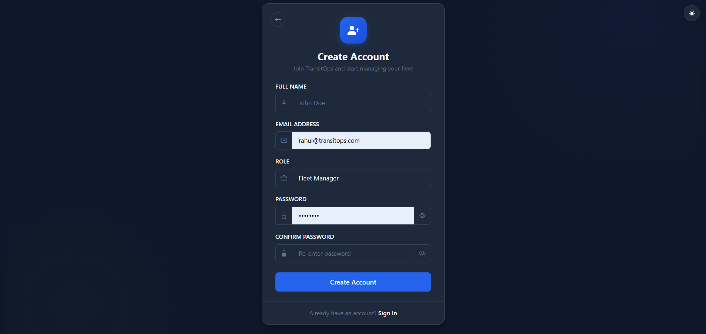
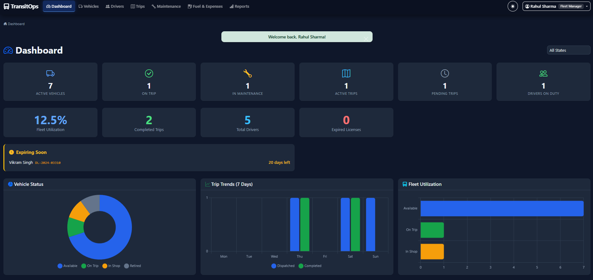
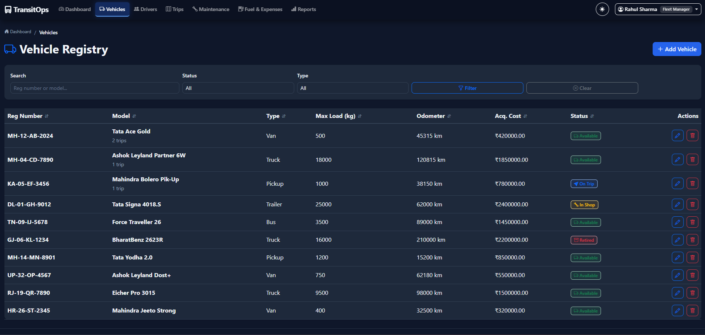
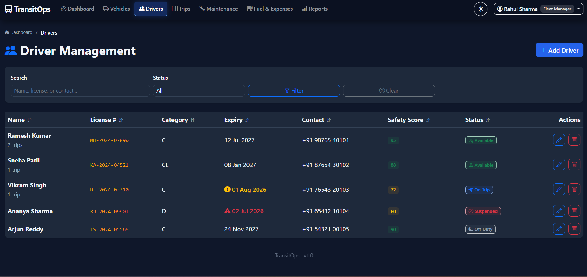
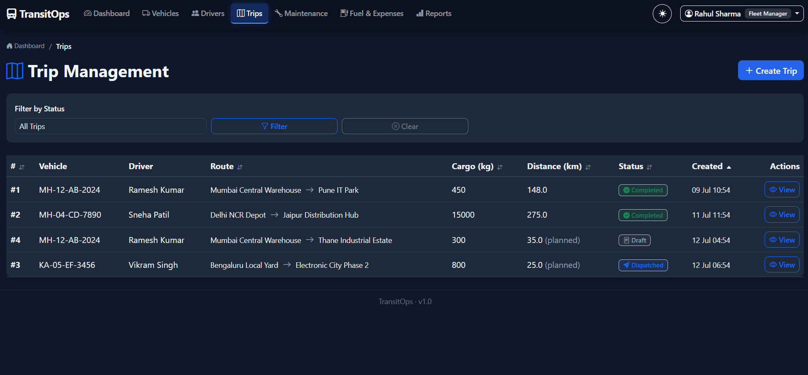
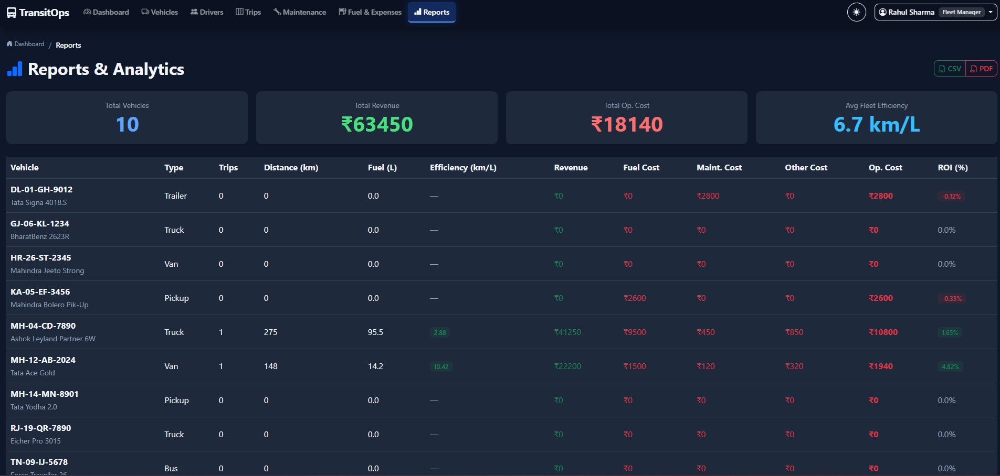

# TransitOps — Smart Transport Operations Platform

A centralized fleet management system built for a hackathon, July 2026.  
Handles the full lifecycle of transport operations — vehicles, drivers,
trips, maintenance, fuel, expenses, and analytics. 

---

## Screenshots

### Landing Page — Dark & Light Mode

<p align="center">
  
  &nbsp;
  
</p>

### Sign Up
<p align="center">
  
</p>

### Dashboard
<p align="center">
  
</p>

### Vehicle Management
<p align="center">
  
</p>

### Driver Management
<p align="center">
  
</p>

### Trip Dispatch & Workflow
<p align="center">
  
</p>

### Reports & Analytics
<p align="center">
  
</p>

---

## Features

| Feature | Description |
|---------|-------------|
| RBAC | 4 roles — Fleet Manager, Driver, Safety Officer, Financial Analyst |
| Vehicle Registry | 10 Indian vehicles (Tata, Mahindra, Ashok Leyland, Eicher) with unique registration plates |
| Driver Management | License expiry alerts, safety scores (0-100), auto-block on expired/suspended |
| Trip Lifecycle | Draft → Dispatched → Completed / Cancelled with automatic status transitions |
| Business Rules | Cargo validation, no double-booking, expired license block, load capacity check |
| Maintenance | Create → auto-switches vehicle to In Shop, close → restores to Available |
| Fuel & Expenses | Per-vehicle logs (fuel, toll, maintenance), auto-cost computation |
| Dashboard | 6 KPI cards, 3 Chart.js charts, region filter by Indian state codes |
| Reports | Fuel efficiency, fleet utilization, operational cost, ROI per vehicle |
| CSV + PDF Export | One-click downloads — CSV with UTF-8 BOM, PDF with ReportLab |
| Account Lockout | 5 failed login attempts → 15-minute lockout with countdown |
| Dark Mode | Full light/dark toggle with localStorage persistence |
| Trip Receipt | Printable waybill-style receipt for completed trips |
| Column Sorting | Click any table header to sort ASC/DESC |

---

## Tech Stack

| Layer | Technology |
|-------|-----------|
| Backend | Python 3 + Flask |
| Database | MySQL (via PyMySQL) |
| ORM | SQLAlchemy + Flask-SQLAlchemy |
| Auth | Flask-Login + bcrypt |
| Frontend | Bootstrap 5 + Jinja2 templates |
| Charts | Chart.js (CDN) |
| PDF Export | ReportLab |
| CSS | Custom with CSS variables for dark mode |

---

## Quick Start

### You'll need
- Python 3.10 or newer
- MySQL running on your machine

### Setup

```bash
# 1. Clone the repo
git clone https://github.com/YOUR-USERNAME/transitops.git
cd transitops

# 2. Install the dependencies
pip install -r requirements.txt

# 3. Create the database (run this in your MySQL client)
CREATE DATABASE transitops;

# 4. (Optional) Edit .env if your MySQL has a password
#    Default assumes root with no password
copy .env.example .env

# 5. Seed the database with demo data
python seed.py

# 6. Start the app
python run.py
```

Open **http://localhost:5000/welcome** in your browser.

---

### Demo Credentials

| Role | Email | Password |
|------|-------|----------|
| Fleet Manager | `rahul@transitops.com` | `admin123` |
| Driver | `priya@transitops.com` | `admin123` |
| Safety Officer | `amit@transitops.com` | `admin123` |
| Financial Analyst | `neha@transitops.com` | `admin123` |

> Pro tip — log in as Fleet Manager first. That role has access to everything.

---

## Project Structure

```
transitops/
├── app/
│   ├── __init__.py          # Flask app factory
│   ├── models.py            # User, Vehicle, Driver, Trip, etc.
│   ├── auth.py              # RBAC + permission decorators
│   ├── utils.py             # KPI data, safe_commit, sorting helpers
│   ├── routes/
│   │   ├── auth.py          # Login, register, profile, landing
│   │   ├── dashboard.py     # KPIs, charts, region filter
│   │   ├── vehicles.py      # Vehicle CRUD
│   │   ├── drivers.py       # Driver CRUD + license checks
│   │   ├── trips.py         # Trip lifecycle, dispatch, receipt
│   │   ├── maintenance.py   # Maintenance workflow
│   │   ├── fuel_expenses.py # Fuel & expense logging
│   │   └── reports.py       # Reports, CSV, PDF
│   ├── templates/
│   │   ├── landing.html     # Landing page
│   │   ├── auth/            # Login, register, profile
│   │   ├── vehicles/        # List, create, edit
│   │   ├── drivers/         # List, create, edit
│   │   ├── trips/           # List, create, view, receipt
│   │   ├── maintenance/     # List, create
│   │   ├── fuel/            # List, create
│   │   ├── reports/         # Reports page
│   │   └── errors/          # 403, 404, 500 pages
│   └── static/
│       ├── css/style.css    # All styles (variables, dark mode, landing)
│       └── js/app.js        # Theme toggle, KPI animation, toasts
├── screenshots/
│   ├── landing-dark.png
│   ├── landing-light.png
│   ├── signup.png
│   ├── dashboard.png
│   ├── vehicles.png
│   ├── drivers.png
│   ├── trips.png
│   └── reports.png
├── config.py                # Flask + DB configuration
├── run.py                   # Entry point
├── seed.py                  # Demo data seeder
├── requirements.txt
├── .env.example
└── README.md
```

---

## Business Rules Enforced

| Rule | Implementation |
|------|---------------|
| Unique vehicle registration | `UNIQUE` constraint on `reg_number` column |
| Cargo must not exceed max load | Live progress bar (green/yellow/red) + server-side validation |
| Expired license driver blocked | `license_expiry > today()` check before dispatch |
| Suspended driver blocked | Status check before dispatch |
| Retired / In Shop vehicles hidden | Filtered from dispatch dropdowns |
| Vehicle & driver can't be double-booked | Status must be `Available` to dispatch |
| Dispatching updates both statuses | `Vehicle.status = "On Trip"`, `Driver.status = "On Trip"` |
| Completing restores both | Set to `Available` only if currently `On Trip` |
| Cancelling restores both | Same guard — only if currently `On Trip` |
| Maintenance → vehicle in shop | Auto-update on create, excludes retired and on-trip vehicles |
| Close maintenance → available | Auto-update on close |
| 5 failed logins → lockout | 15-minute cooldown with rate limiter and countdown |

---

## Team

| Name | Role | Worked On |
|------|------|-----------|
| Mohit W | Backend Lead | DB schema, auth, config, seed data, README |
| Om Aloni | Module Dev | Vehicles, drivers, dashboard, utility functions |
| Aryan Sevak | Workflow Dev | Trips, maintenance, fuel, expenses, reports |
| Suraj Dubey | Frontend Dev | Templates, CSS, JS, dark mode, landing page |

---

## License

MIT. Use it, modify it, learn from it.
